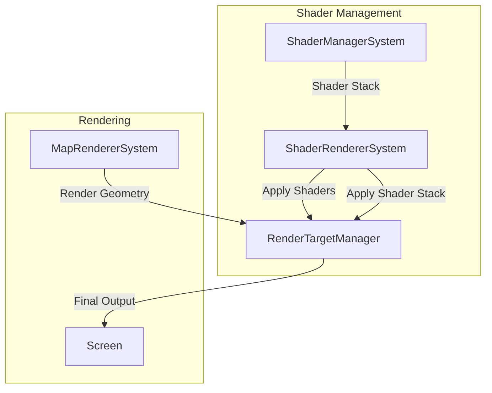

# Plan Architecture and MonoGame Issues Analysis

**Generated:** 2025-01-27  
**Plan:** Advanced Shader Features Implementation

---

## Critical Issues

### 1. Shader Stacking Implementation Misunderstanding

**Issue:** Plan suggests applying shaders in sequence with `BlendState` changes, but this won't work for shader effects.

**Problem:**
- Shaders modify pixel colors through GPU computation
- `BlendState` only controls how pixels blend during SpriteBatch drawing
- To stack shaders, you need to apply each shader to the OUTPUT of the previous shader
- This requires rendering to intermediate render targets, not just changing BlendState

**Current Plan (WRONG):**
```csharp
// First shader: Render normally
_spriteBatch.Begin(..., shader1, ...);
// Subsequent shaders: Render with BlendState
_spriteBatch.Begin(..., BlendState.Additive, shader2, ...);
```

**Correct Approach:**
```csharp
// Render scene to render target 1 with shader 1
RenderToTarget(target1, shader1);
// Render target1 to target2 with shader 2
RenderToTarget(target2, shader2, source: target1);
// Final: Render target2 to screen
RenderToScreen(target2);
```

**Impact:** **CRITICAL** - Shader stacking won't work as described

**Fix Required:** Shader stacking for tile/sprite layers requires render targets, not just BlendState changes.

---

### 2. Blend Mode Limitations

**Issue:** Plan mentions using MonoGame `BlendState` for Multiply, Overlay, Screen blend modes, but these aren't supported.

**Problem:**
- MonoGame `BlendState` supports: Opaque, AlphaBlend, Additive, NonPremultiplied, Multiply (limited)
- `BlendState.Multiply` exists but works differently than shader-based multiply
- Overlay and Screen blend modes are NOT available in BlendState
- These require shader-based blending or custom blend states

**Current Plan:**
- Option A suggests falling back to Replace with warning
- Option B mentions render targets but doesn't clarify when to use it

**Impact:** **HIGH** - Advanced blend modes won't work

**Fix Required:** Clarify that complex blend modes (Multiply, Overlay, Screen) require shader-based blending with render targets.

---

### 3. Depth Buffer API Misunderstanding

**Issue:** Plan mentions `GetOrCreateDepthBuffer()` method, but MonoGame doesn't work this way.

**Problem:**
- In MonoGame, depth buffer is part of `RenderTarget2D`, not separate
- You specify `DepthFormat` when creating `RenderTarget2D`
- There's no separate depth buffer object to "get"
- Depth is automatically available when render target has depth format

**Current Plan:**
```csharp
// WRONG - This doesn't exist in MonoGame
public RenderTarget2D? GetOrCreateDepthBuffer()
```

**Correct Approach:**
```csharp
// Create render target WITH depth
var renderTarget = new RenderTarget2D(
    graphicsDevice,
    width,
    height,
    false,
    SurfaceFormat.Color,
    DepthFormat.Depth24Stencil8  // Depth is part of render target
);

// Depth is automatically available when rendering to this target
// To pass depth to shader, you'd need to render depth to a separate texture
```

**Impact:** **CRITICAL** - Depth buffer API doesn't match MonoGame

**Fix Required:** Remove `GetOrCreateDepthBuffer()` method. Depth is part of render target creation.

---

### 4. Component Design Violation

**Issue:** `ShaderParameterTimelineComponent` uses `List<>` in a struct component.

**Problem:**
- ECS components should be value types (`struct`)
- Value types with reference types (like `List<>`) cause issues:
  - Copying components creates new list references
  - Modifications affect all copies
  - Breaks ECS component isolation

**Current Plan:**
```csharp
public struct ShaderParameterTimelineComponent
{
    public List<ShaderParameterKeyframe> Keyframes { get; set; }  // ❌ Reference type in struct
}
```

**Impact:** **HIGH** - ECS architecture violation

**Fix Required:** Use array or separate component for keyframes, or make component a class (not recommended).

**Options:**
1. Use `ShaderParameterKeyframe[]` array (fixed size, or resize when needed)
2. Store keyframe count and use separate `KeyframeComponent` per keyframe
3. Use `IReadOnlyList<ShaderParameterKeyframe>` and store in separate system (not component)

---

## Architecture Issues

### 5. Separation of Concerns Violation

**Issue:** Plan suggests rendering systems handle shader stack application logic.

**Problem:**
- `MapRendererSystem` and `SpriteRendererSystem` should focus on rendering geometry
- Shader application logic should be in `ShaderManagerSystem` or dedicated `ShaderRendererSystem`
- Mixing concerns makes code harder to maintain

**Current Plan:**
- Rendering systems get shader stack and apply it themselves
- Each system duplicates shader application logic

**Impact:** **MEDIUM** - Code duplication and maintenance burden

**Fix Required:** Create `ShaderRendererSystem` or extend `ShaderManagerSystem` to handle shader stack application.

---

### 6. Performance Concerns

**Issue:** Multiple shader passes will require multiple `SpriteBatch.Begin/End` cycles.

**Problem:**
- Each `SpriteBatch.Begin/End` has overhead
- Multiple passes = multiple draw calls
- For tile/sprite layers, this could be expensive

**Current Plan:**
- Doesn't address performance implications
- No mention of batching optimizations

**Impact:** **MEDIUM** - Performance degradation with many shaders

**Fix Required:** Consider performance impact and document optimization strategies.

---

### 7. Render Target Management

**Issue:** Plan mentions "pool of render targets" but doesn't specify management strategy.

**Problem:**
- Multiple render targets need lifecycle management
- When to create/dispose targets?
- How to handle viewport size changes?
- Memory management for multiple targets

**Current Plan:**
- Vague on render target pooling strategy
- No clear disposal strategy

**Impact:** **MEDIUM** - Potential memory leaks or performance issues

**Fix Required:** Specify render target lifecycle management strategy.

---

## MonoGame-Specific Issues

### 8. SpriteBatch Effect Limitation

**Issue:** `SpriteBatch.Begin()` only accepts one `Effect` parameter.

**Problem:**
- You can't apply multiple effects in one SpriteBatch.Begin()
- Each shader needs its own render pass
- This is correct, but plan should clarify this limitation

**Impact:** **LOW** - Plan is correct but could be clearer

**Fix Required:** Clarify that each shader requires separate render pass.

---

### 9. Depth Buffer Access in Shaders

**Issue:** Plan mentions passing depth buffer to shaders, but doesn't explain how.

**Problem:**
- Depth buffer isn't directly accessible as a texture in MonoGame
- To use depth in shader, you need to render depth to a separate texture
- Or use `RenderTarget2D` with depth and sample depth in shader (if supported)

**Current Plan:**
- Mentions "Depth buffer passed as Texture2D to shaders"
- Doesn't explain how to extract depth from render target

**Impact:** **MEDIUM** - Implementation unclear

**Fix Required:** Clarify depth buffer access method (render depth to texture or use render target depth).

---

### 10. Render Target Format Consistency

**Issue:** Plan doesn't specify surface format consistency for render target chain.

**Problem:**
- Render targets in a chain should use consistent formats
- Format mismatches can cause issues
- Need to specify format strategy

**Impact:** **LOW** - Minor issue, but should be addressed

**Fix Required:** Specify surface format strategy for render target chain.

---

## Recommendations

### Critical Fixes

1. **Fix Shader Stacking Approach:**
   - For tile/sprite layers: Use render targets for shader stacking
   - For combined layer: Already uses render targets (correct)
   - Clarify that BlendState is for pixel blending, not shader stacking

2. **Fix Depth Buffer API:**
   - Remove `GetOrCreateDepthBuffer()` method
   - Specify `DepthFormat` when creating render targets
   - Clarify how depth is accessed in shaders

3. **Fix Component Design:**
   - Use array instead of `List<>` in `ShaderParameterTimelineComponent`
   - Or use separate keyframe storage system

### Important Fixes

4. **Clarify Blend Mode Implementation:**
   - Document that complex blend modes require shader-based blending
   - Specify when to use Option A vs Option B

5. **Improve Architecture:**
   - Consider `ShaderRendererSystem` for shader application logic
   - Keep rendering systems focused on geometry rendering

6. **Add Performance Considerations:**
   - Document performance impact of multiple passes
   - Suggest optimization strategies

### Nice-to-Have

7. **Clarify Render Target Management:**
   - Specify lifecycle management strategy
   - Document disposal patterns

8. **Document Depth Buffer Usage:**
   - Explain how depth is accessed in shaders
   - Provide example shader code

---

## Revised Architecture Suggestion



**Key Changes:**
- `ShaderRendererSystem` handles shader application logic
- Rendering systems focus on geometry
- Clear separation of concerns

